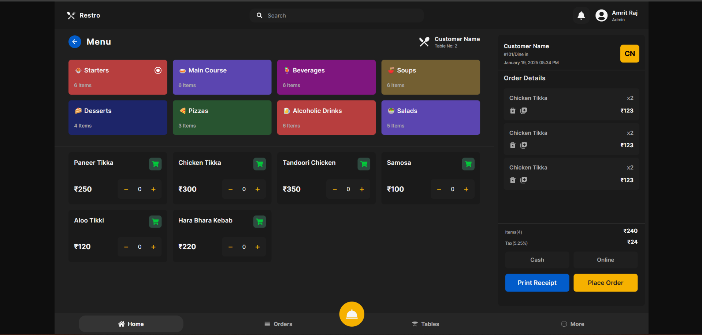
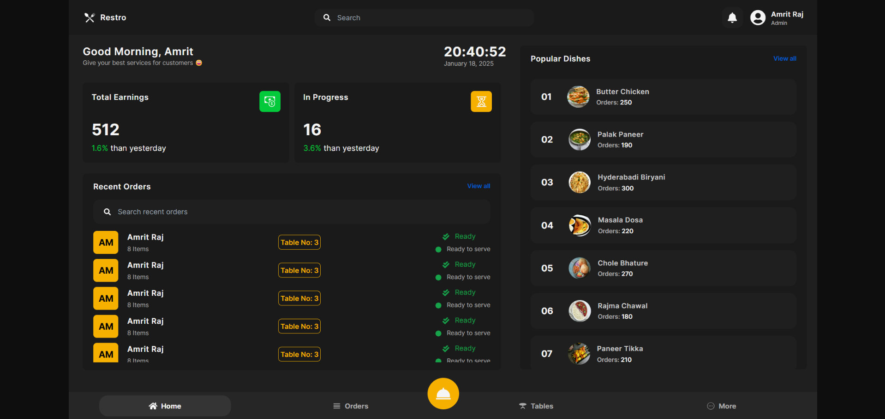
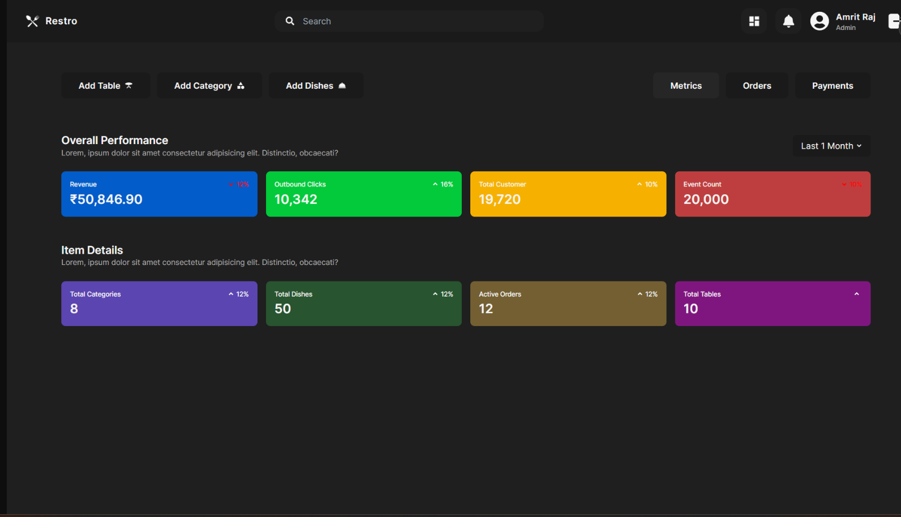
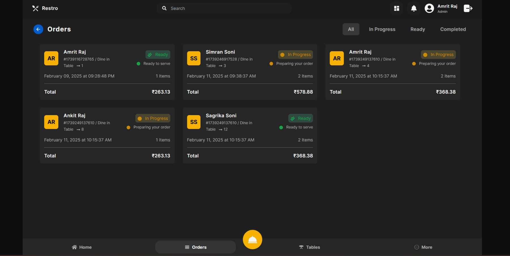

<div align="center">

# 🍽️ Restaurant POS System

### *Streamline Orders. Simplify Payments. Elevate Dining.*

**A full-featured Point of Sale system built on the MERN stack — manage orders, reservations, billing, and payments all in one place.**

[](https://restaurant-pos-system-7vrf.vercel.app/)
[](https://github.com/pranithamalasala/restaurant-pos-system)
[](LICENSE)
[](CONTRIBUTING.md)

</div>

---

## 📸 Screenshots

| | |
|:---:|:---:|
|  |  |
|  |  |

---

## ✨ Features

| Feature | Description |
|---------|-------------|
| 🍽️ **Order Management** | Real-time order tracking and status updates |
| 🪑 **Table Reservations** | Book and manage tables directly from the POS |
| 🔐 **Authentication** | JWT-based secure login with role-based access (Admin / Staff / User) |
| 💸 **Payment Integration** | Razorpay integration for seamless online payments |
| 🧾 **Billing & Invoicing** | Auto-generated detailed bills for every order |
| 📊 **State Management** | Redux Toolkit for predictable app-wide state |
| ⚡ **Data Fetching** | React Query for smart caching and background sync |

---

## 🏗 Tech Stack

| Layer | Technology |
|-------|-----------|
| **Frontend** | React.js, Redux Toolkit, Tailwind CSS, React Query |
| **Backend** | Node.js, Express.js |
| **Database** | MongoDB |
| **Authentication** | JWT, bcrypt |
| **Payments** | Razorpay |
| **Deployment** | Vercel (Frontend), Render/Railway (Backend) |

---

## 🚀 Quick Start

### Prerequisites
- Node.js 18+
- MongoDB (local or Atlas)
- Razorpay account (for payments)

### 1. Clone the repo
```bash
git clone https://github.com/pranithamalasala/restaurant-pos-system.git
cd restaurant-pos-system
```

### 2. Setup Backend
```bash
cd pos-backend
npm install
```

Create a `.env` file in `pos-backend/`:
```env
PORT=5000
MONGO_URI=your_mongodb_connection_string
JWT_SECRET=your_jwt_secret
RAZORPAY_KEY_ID=your_razorpay_key
RAZORPAY_KEY_SECRET=your_razorpay_secret
```

```bash
npm run dev
```
> Runs at **http://localhost:5000**

### 3. Setup Frontend
```bash
cd pos-frontend
npm install
```

Create a `.env` file in `pos-frontend/`:
```env
VITE_BACKEND_URL=http://localhost:5000
```

```bash
npm run dev
```
> Runs at **http://localhost:5173**

---

## 📁 Project Structure

```
restaurant-pos-system/
├── pos-backend/
│   ├── controllers/       # Route handlers
│   ├── models/            # MongoDB schemas
│   ├── routes/            # API routes
│   ├── middleware/        # Auth & error handling
│   └── server.js
├── pos-frontend/
│   ├── src/
│   │   ├── components/    # Reusable UI components
│   │   ├── pages/         # Orders, Tables, Billing...
│   │   ├── store/         # Redux slices
│   │   └── api/           # React Query hooks
│   └── vite.config.js
├── CONTRIBUTING.md
├── DEPLOYMENT.md
└── README.md
```

---

## 🔌 API Overview

| Method | Endpoint | Description |
|--------|----------|-------------|
| `POST` | `/api/auth/login` | User login |
| `GET` | `/api/orders` | Get all orders |
| `POST` | `/api/orders` | Create new order |
| `PUT` | `/api/orders/:id` | Update order status |
| `GET` | `/api/tables` | Get table availability |
| `POST` | `/api/reservations` | Book a table |
| `POST` | `/api/payments/create` | Initiate Razorpay payment |
| `POST` | `/api/payments/verify` | Verify payment |

---

## 📚 Resources

- 🎬 [YouTube Tutorial Playlist](https://www.youtube.com/playlist?list=) — Follow the full build series
- 📦 [Project Assets](https://drive.google.com/) — Google Drive assets
- 🗺️ [Project Flowchart](https://www.figma.com/) — Architecture diagram
- 🎨 [Design Reference](https://www.behance.net/) — Behance UI/UX inspiration
- 📋 [Deployment Guide](DEPLOYMENT.md) — Step-by-step deployment instructions

---

## 🤝 Contributing

Contributions are welcome! Please read [CONTRIBUTING.md](CONTRIBUTING.md) before submitting a pull request.

```bash
# Fork → Clone → Branch → Commit → Push → PR
git checkout -b feature/your-feature-name
git commit -m "feat: add your feature"
git push origin feature/your-feature-name
```

---

## 🗺 Roadmap

- [ ] Kitchen display system (KDS)
- [ ] Inventory & stock management
- [ ] Sales analytics & reports
- [ ] Multi-branch support
- [ ] Mobile app (React Native)

---

## 👩‍💻 Contributors

<table>
  <tr>
    <td align="center">
      <a href="https://github.com/pranithamalasala">
        <b>Pranitha</b><br/>
        <sub>Developer</sub>
      </a>
    </td>
  </tr>
</table>

---

## 📄 License

This project is licensed under the [MIT License](LICENSE).

---

<div align="center">

**Built with ❤️ to make restaurant operations effortless**

⭐ If you found this helpful, please star the repository!

[](https://github.com/pranithamalasala/restaurant-pos-system)

</div>
